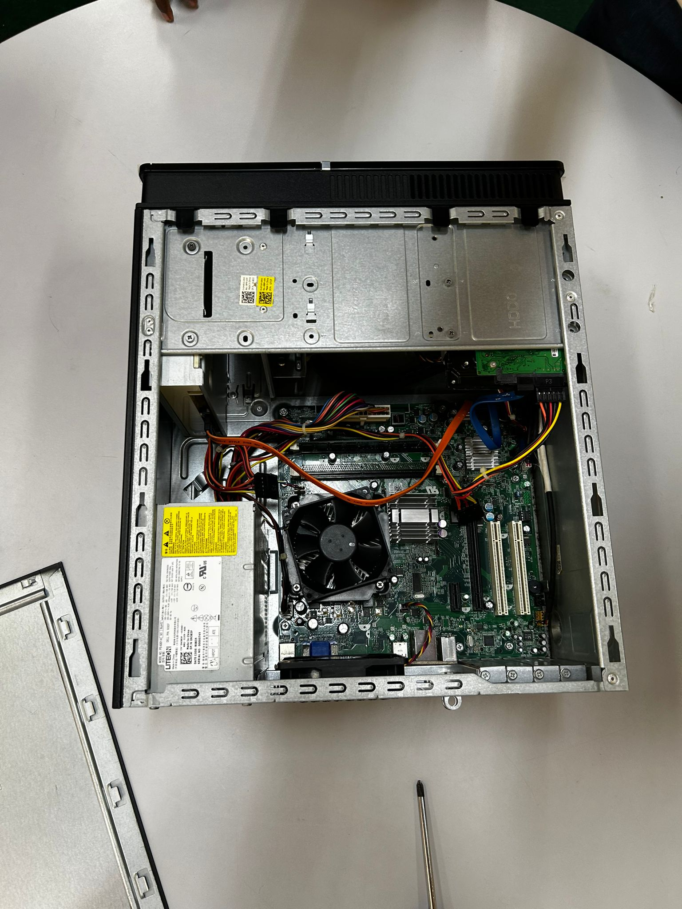
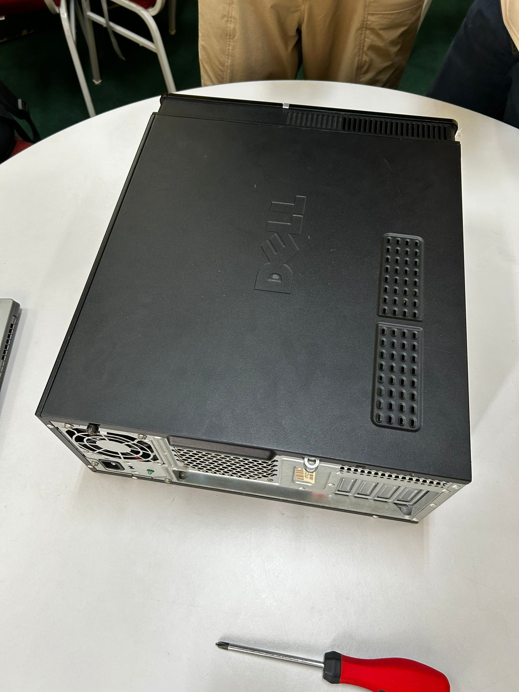

# 🖥️ PC Assemble (Lab)
**Course:** Technology and Information System (SECP1513)  
**Type:** Lab Practical  
**Topic:** PC Hardware De-assembly and Re-assembly

---

## 📌 Overview
This lab activity focused on learning computer hardware through **hands-on PC de-assembly and re-assembly**. We opened the desktop casing, identified the internal components, disconnected parts safely, and then assembled everything back step-by-step.

---

## 🧱 PC Components
- Power Supply Unit (PSU)  
- Motherboard  
- CPU + heatsink/fan  
- RAM slots  
- SATA data + power cables  
- Storage bay area (HDD/SSD location)  
- PCI/expansion slots  
- Internal connectors and wiring

---

## 💡 Reflection
This lab helped me understand the physical structure of a desktop PC and how components connect to work as one system. By doing the de-assembly and re-assembly myself, I learned the importance of correct cable connections, careful installation, and organized arrangement inside the case.

Overall, it improved my confidence in handling basic hardware tasks and gave me a stronger foundation for troubleshooting and maintenance in the future.

---

## 📎 Evidence (Photos)
### 🖼️ De-assembly

### 🖼️ Final Assembled Result

