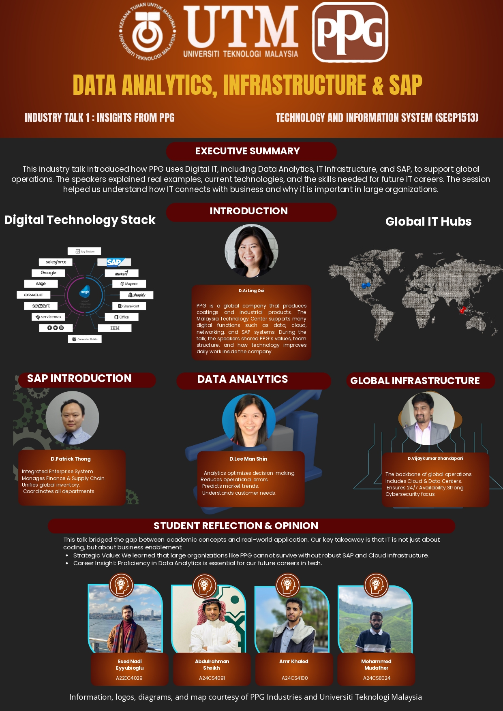

# 📝 Poster (Industry Talk 1)

---

## 📌 Overview
This poster summarizes **Industry Talk 1** and explains how **PPG** uses **Digital IT**—especially **Data Analytics**, **IT Infrastructure**, and **SAP**—to support global operations. The main idea highlighted is that IT is not only about coding; it enables business processes, integration, and better decision-making.

---

## 🧠 Reflection
This industry talk helped me connect what we learn in class to real organizational needs. I learned that large companies depend on enterprise platforms (like SAP) and cloud infrastructure to keep operations consistent and reliable across regions. It also made me realize that data analytics is a major skill area because it supports smarter decisions and business performance.

---

### 🖼️ Poster Preview

